# mongodb-with-admin-gui-in-k8s
Me learning kubernetes: Mongo-DB with Mongo-Express admin GUI in web browser

I got the starting code for this project from [this free kubernetes course](https://www.youtube.com/watch?v=X48VuDVv0do&t=2542s)

```mermaid
---
title: "my title"
---
flowchart LR 
    A["Browser<br>GUI"] --> B["External<br>service"]
    B --> C["Mongo Express"]
    C --> D["Internal<br>Service"]
    D --> E["<span>&#9921;</span><br>MongoDB<br>database"]
    F["MongoDB<br>Secret<br>"] --> E
```



Start [minikube](https://github.com/kubernetes/minikube) cluster:
```bash
~$ minikube start
```

```bash
~$ kubectl get all
```

```bash
~$ kubectl apply -f configs/mongodb-secret.yaml
```

```bash
~$ kubectl get secret
```

```bash
~$ kubectl apply -f configs/mongodb.yaml
```

```bash
~$ kubectl get pod --watch --output wide
```

```bash
~$ kubectl describe pod <pod-name-here> # copy pod name from "kubectl get pod" output
```

```bash
~$ kubectl describe service mongodb-service
```

```bash
~$ kubectl get all | grep mongodb
```

```bash
~$ kubectl apply -f configs/mongo-configmap.yaml
```

```bash
~$ kubectl apply -f configs/mongo-express.yaml
```

```bash
~$ kubectl get service
```

```bash
~$ kubectl get pod
```

```bash
~$ kubectl get pod --watch --output wide
```

```bash
~$ kubectl logs <pod-name-here> # get pod name from "kubectl get pod" output
```

```bash
~$ minikube service mongo-express-service
```


