# mongodb-with-admin-gui-in-k8s
Me learning kubernetes: Mongo-DB with Mongo-Express admin GUI in web browser

I got the starting code for this project from [this free kubernetes course](https://www.youtube.com/watch?v=X48VuDVv0do&t=2542s)

```mermaid
---
title: "my title"
---
flowchart LR 
    A["Browser<br>GUI"] --> B["External<br>service"]
    B --> C["Mongo Express"]
    C --> D["Internal<br>Service"]
    D --> E["<span>&#9921;</span><br>MongoDB<br>database"]
```



```bash
~$ kubectl get all
```

```bash
~$ kubectl apply -f configs/mongodb-secret.yaml
```

```bash
~$ kubectl get secret
```

```bash
~$ kubectl apply -f configs/mongodb.yaml
```

```bash
~$ kubectl get pod --watch
```

```bash
~$ kubectly describe pod <pod-name-here>
```


